Python Tkinter-module based GUI Password Generator/Manager

Encrypted with AES-256 using the profile password

Have I Been Pwned integration:
If an API key is provided in the settings, pressing
"Check Accounts" or "Check Passwords" queries the HIBP database
for all user emails/passwords to check if they are in any breaches

Sleek interface — various theme options are included

Local profile storage

Password strength indicator including common password detection based on the most common 100,000 passwords compiled by Troy Hunt of Have I Been Pawned,
found here: https://github.com/danielmiessler/SecLists/tree/master/Passwords/Common-Credentials

  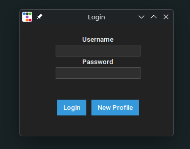
  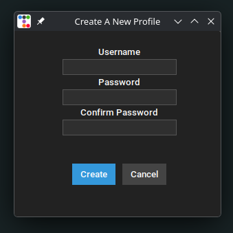
  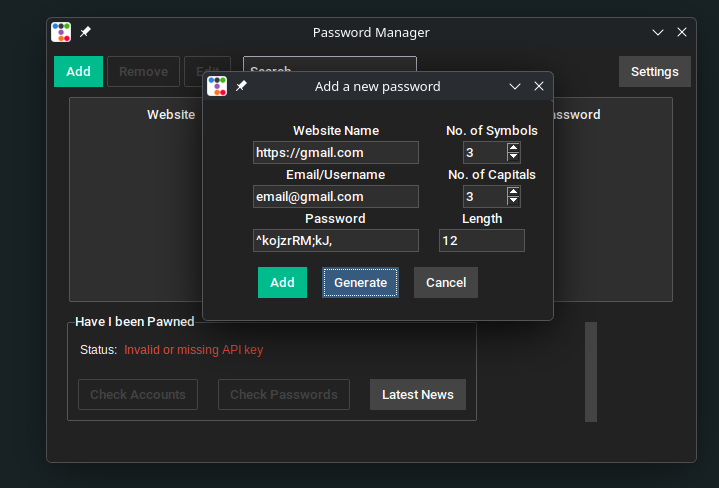

  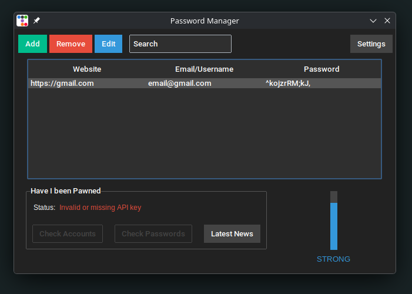
  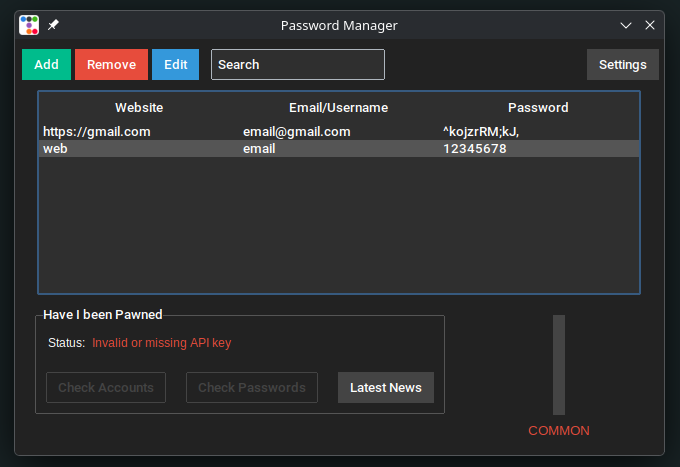
  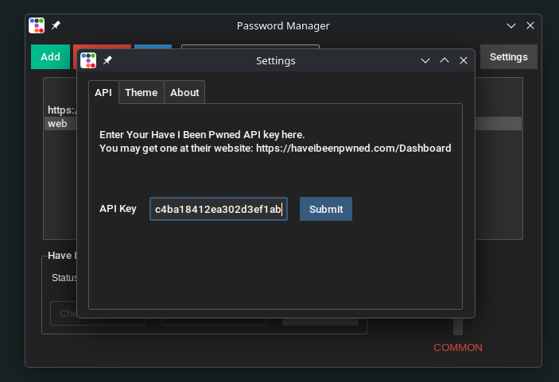

  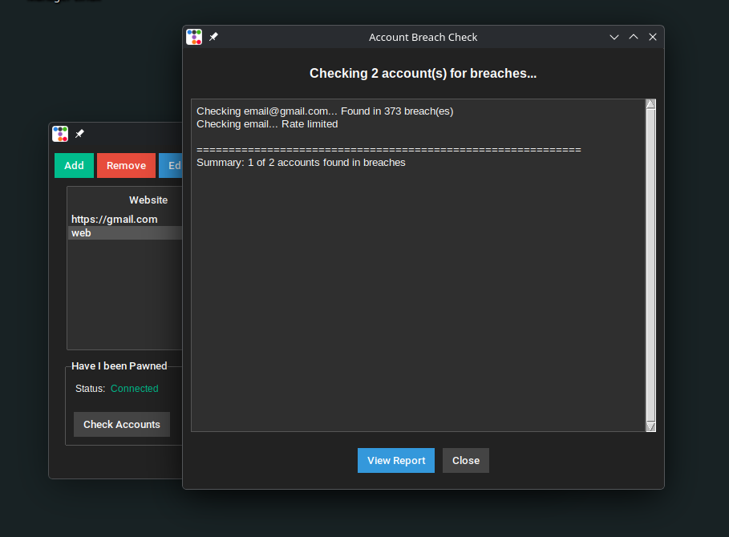
  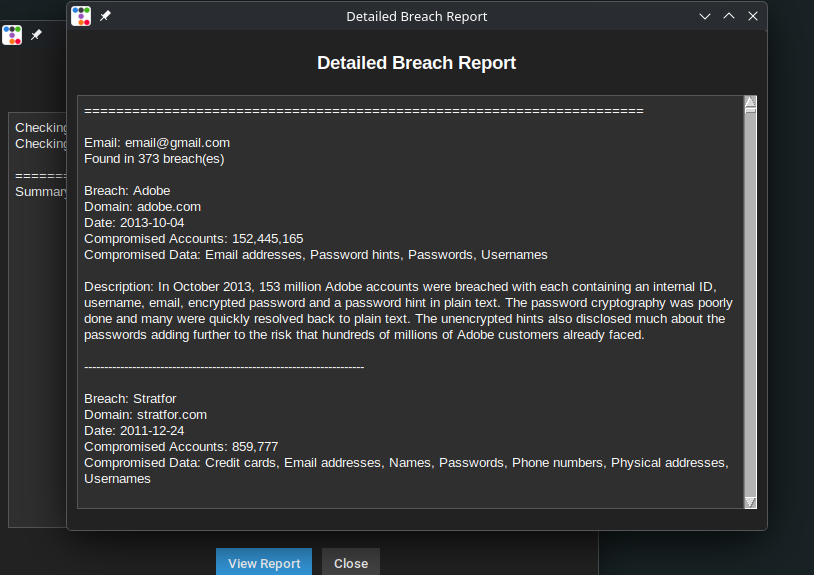
  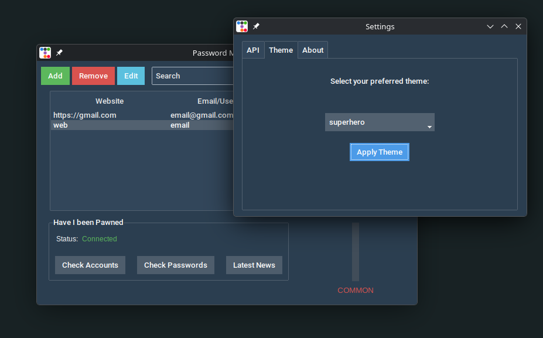

  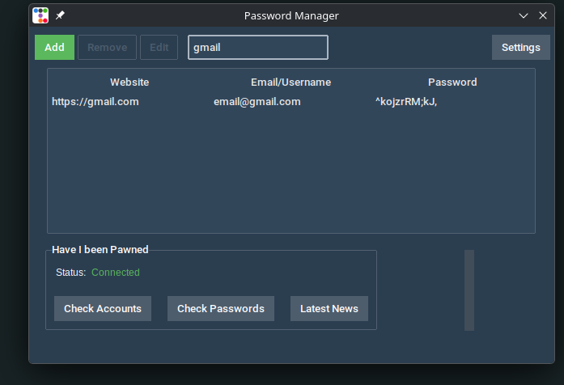
  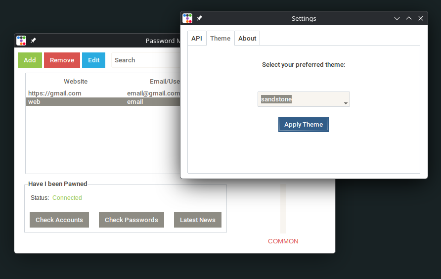
  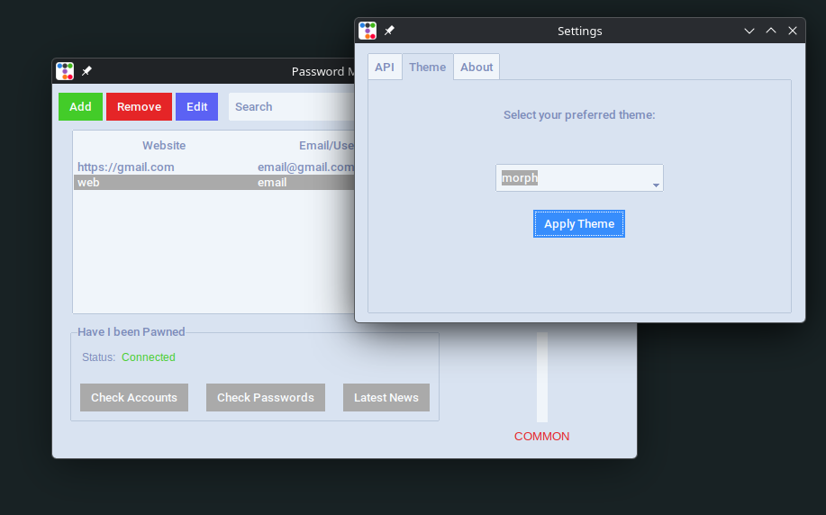

